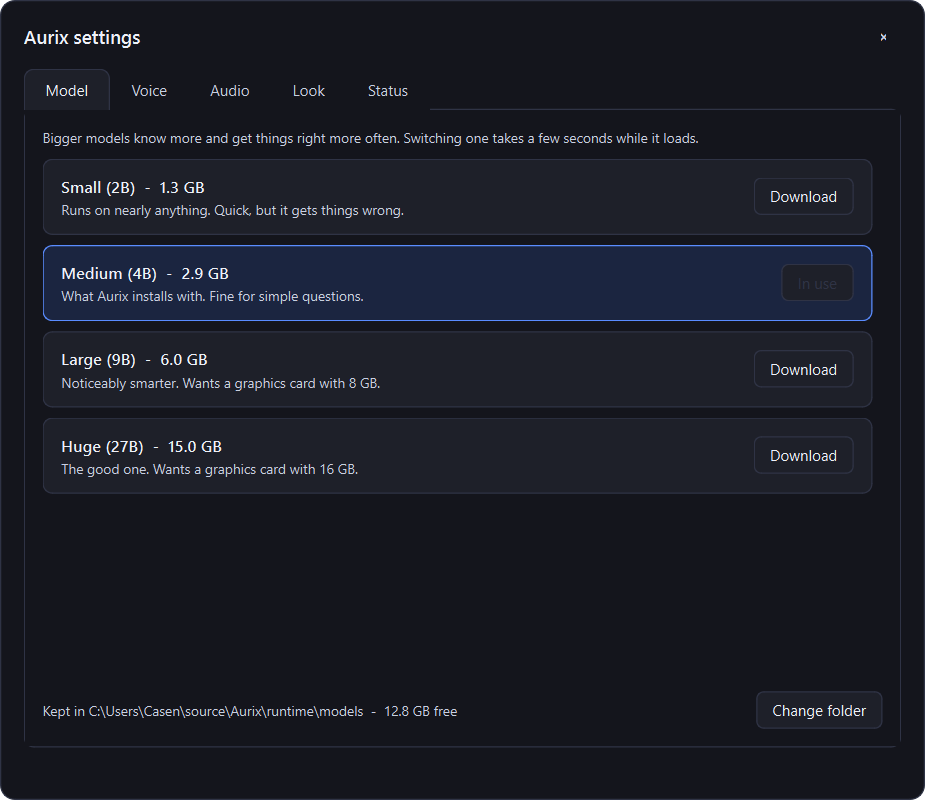

# Aurix

A voice assistant that runs on your own computer.


## Install

Grab the installer from [Releases](../../releases) and run it. It pulls down
the language model during setup, so that's the only step.

Windows will call it unrecognised because it isn't signed - hit **More info**,
then **Run anyway**.

## Using it

Sits in the system tray as a blue dot.

- Say **"Hey Jarvis"**, pause, then ask.
- Or press **Ctrl + Alt + G**.
- Click the tray icon for the quick panel, or **Settings** for everything else.

As well as answering questions it can do a few things:

- *"Play Take On Me"*, *"play the rock classics playlist"* - Spotify, no
  account needed, the song is found by searching the web.
- *"Pause"*, *"skip this song"*, *"go back"* - works with any music player.
- *"Open YouTube"*, *"pull up the Wikipedia page for the Eiffel Tower"* -
  anything it does not recognise it searches for and opens the top result.

It only ever opens web links and Spotify. It will not run a program.


Settings is where you swap the model for a bigger one, change the voice, and
see whether your graphics card is actually being used.



## Building it

```powershell
py -m venv .venv
.venv\Scripts\pip install -r requirements.txt
.venv\Scripts\python main.py
```

The models live in `runtime/`, which isn't in the repo. To build the installer:

```powershell
.venv\Scripts\pyinstaller --noconfirm aurix.spec
"$env:LOCALAPPDATA\Programs\Inno Setup 6\ISCC.exe" installer.iss
```

Built on [faster-whisper](https://github.com/SYSTRAN/faster-whisper),
[openWakeWord](https://github.com/dscripka/openWakeWord),
[llama.cpp](https://github.com/ggml-org/llama.cpp) and
[Piper](https://github.com/rhasspy/piper).
