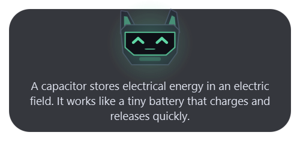
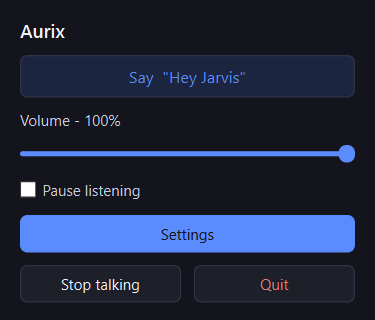
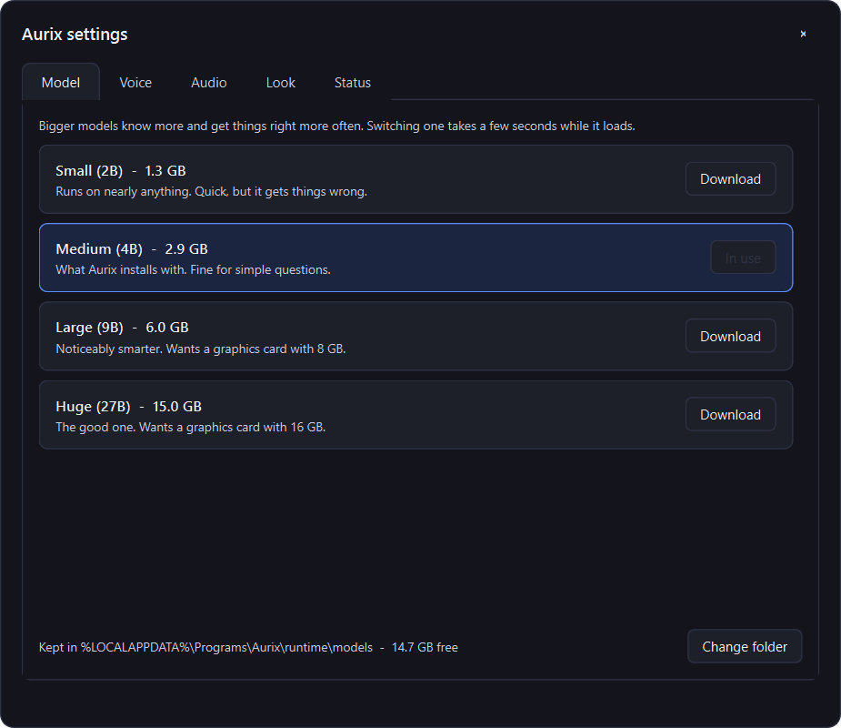
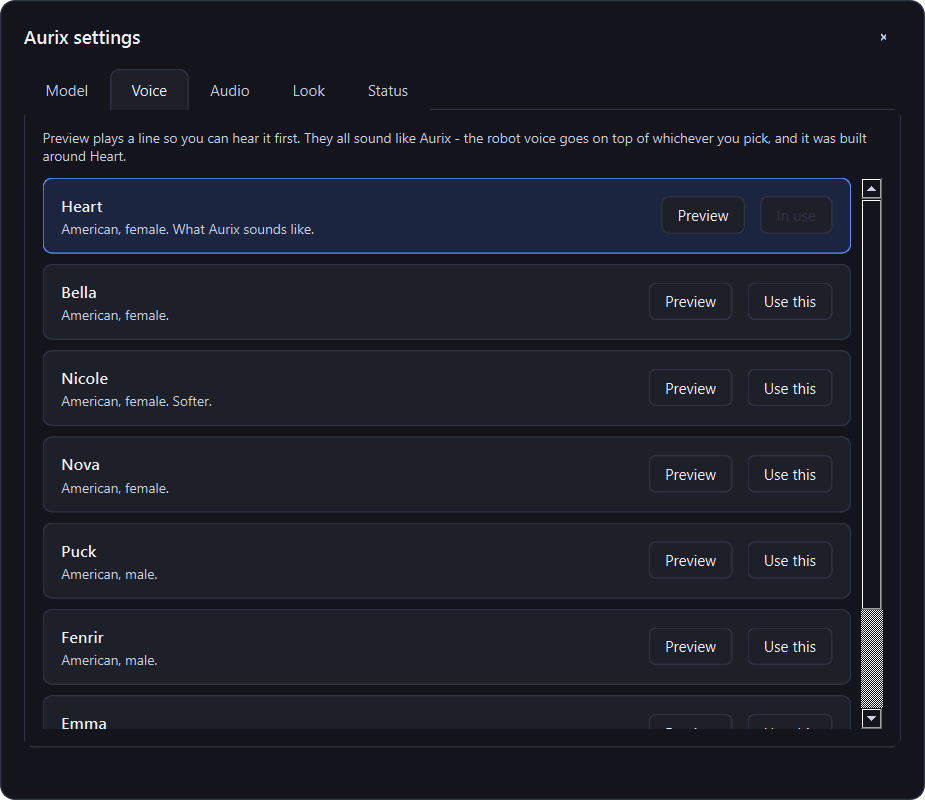

# Aurix

A silly little voice assistant.



## Install

Grab the installer from [Releases](../../releases) and run it. It pulls down
the language model during setup, so that's the only step.

Windows will call it unrecognised because it isn't signed - hit **More info**,
then **Run anyway**.

## Using it

Sits in the system tray as a blue dot.

- Say **"Hey Jarvis"**, then ask.
- Or press **Ctrl + Alt + G**.
- Click the tray icon for the quick panel, or **Settings** for everything else.


It works out when you have actually finished talking instead of counting a
second of quiet, so stopping to think mid-sentence no longer cuts you off.

As well as answering questions it can do a few things:

- *"Play Take On Me"*, *"play the rock classics playlist"*, *"play the Rumours
  album"* - Spotify, no account needed, the song is found by searching the web.
  It puts Spotify back where it found it, so if it was closed or minimised the
  music starts without the window taking over the screen. Anything you have
  played before starts straight away, since it remembers what it found.
- *"Pause"*, *"skip this song"*, *"go back"* - works with any music player.
- *"Open YouTube"*, *"pull up the Wikipedia page for the Eiffel Tower"* -
  anything it does not recognise it searches for and opens the top result.
- *"Open Discord"*, *"start Steam"* - programs you already have. It only knows
  what is in your Start Menu, and it will not open a shell or a system tool.



Settings is where you swap the model for a bigger one, pick a different voice,
and see what it has been up to - including the last thing it looked up, so the
claim that nothing but a search query ever leaves the machine is something you
can check rather than take on trust.





## Building it

```powershell
py -m venv .venv
.venv\Scripts\python.exe -m pip install -r requirements.txt
.venv\Scripts\python.exe main.py
```

The models live in `runtime/`, which isn't in the repo. To build the installer:

```powershell
.venv\Scripts\python.exe -m PyInstaller --noconfirm aurix.spec
"$env:LOCALAPPDATA\Programs\Inno Setup 6\ISCC.exe" installer.iss
```

Run the venv's tools as modules like that. The `.exe` shims hardcode the path
the venv was built at, so if it ever moves they exit with an error code and
print nothing at all.

Built on [faster-whisper](https://github.com/SYSTRAN/faster-whisper),
[openWakeWord](https://github.com/dscripka/openWakeWord),
[llama.cpp](https://github.com/ggml-org/llama.cpp) and
[Kokoro](https://github.com/thewh1teagle/kokoro-onnx).
