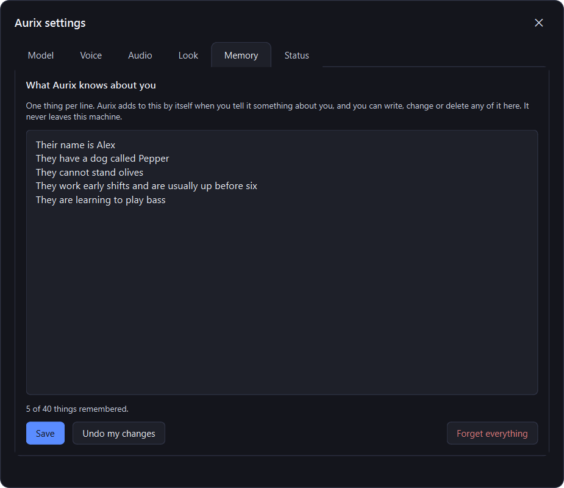

# Aurix

A silly little voice assistant.


## Install

Grab the installer from [Releases](../../releases) and run it. It pulls down
the language model during setup, so that's the only step.

Windows will call it unrecognised because it isn't signed - hit **More info**,
then **Run anyway**.

## Using it

Sits in the system tray as a blue dot.

- Say **"Hey Aurix"**, then ask.
- Or press **Ctrl + Alt + G**.
- Click the tray icon for the quick panel, or **Settings** for everything else.


It works out when you have actually finished talking instead of counting a
second of quiet, so stopping to think mid-sentence no longer cuts you off.

It has a personality, and a switch to turn it off. **Fun mode** is chatty and
pleased to be asked; turn it off and answers go back to one or two flat
sentences, which is quicker to hear. Both are on the Audio tab.

As well as answering questions it can do a few things:

- *"Play Take On Me"*, *"play the rock classics playlist"*, *"play the Rumours
  album"* - Spotify, no account needed, the song is found by searching the web.
  It puts Spotify back where it found it, so if it was closed or minimised the
  music starts without the window taking over the screen. Anything you have
  played before starts straight away, since it remembers what it found.
- *"Pause"*, *"skip this song"*, *"go back"* - works with any music player.
- *"Open YouTube"*, *"pull up the Wikipedia page for the Eiffel Tower"* -
  anything it does not recognise it searches for and opens the top result.
- *"Open Discord"*, *"start Steam"* - programs you already have. It only knows
  what is in your Start Menu, and it will not open a shell or a system tool.


Settings is where you swap the model for a bigger one, pick a different voice,
and see what it has been up to - including the last thing it looked up, so the
claim that nothing but a search query ever leaves the machine is something you
can check rather than take on trust.


## It remembers you

Tell it something about yourself and it keeps it. Not the conversation - that
is forgotten after a few minutes - but the handful of things worth knowing next
week: your name, your dog, what you cannot stand, how you want it to behave.

It decides what is worth keeping on its own, and you can read and change every
word of it. The notes are plain text in `memory.txt` next to the settings, and
the Memory tab shows you that same text to edit. There is a button to forget
the lot.



## Gaming mode

A game and a language model both want video memory, and whichever asks second
loses - either the model will not load, or your textures get pushed out to
system memory and the game stutters.

So Aurix gets out of the way. While something else is using the graphics card,
the model runs on the processor instead and stays there until you are done. It
costs about half a second longer before it starts answering, which the "hmm"
mostly covers.

It works this out by itself - the rule is whether what is left on the card would
still fit the model, so it suits itself to your machine rather than to a number
somebody picked. On the Model tab you can force it on or off instead. If your
card is big enough that a game never fills it, this will never do anything.

## Building it

```powershell
py -m venv .venv
.venv\Scripts\python.exe -m pip install -r requirements.txt
.venv\Scripts\python.exe main.py
```

The models live in `runtime/`, which isn't in the repo. To build the installer:

```powershell
.venv\Scripts\python.exe -m PyInstaller --noconfirm aurix.spec
"$env:LOCALAPPDATA\Programs\Inno Setup 6\ISCC.exe" installer.iss
```

Run the venv's tools as modules like that. The `.exe` shims hardcode the path
the venv was built at, so if it ever moves they exit with an error code and
print nothing at all.

Built on [faster-whisper](https://github.com/SYSTRAN/faster-whisper),
[openWakeWord](https://github.com/dscripka/openWakeWord),
[llama.cpp](https://github.com/ggml-org/llama.cpp) and
[Kokoro](https://github.com/thewh1teagle/kokoro-onnx).
